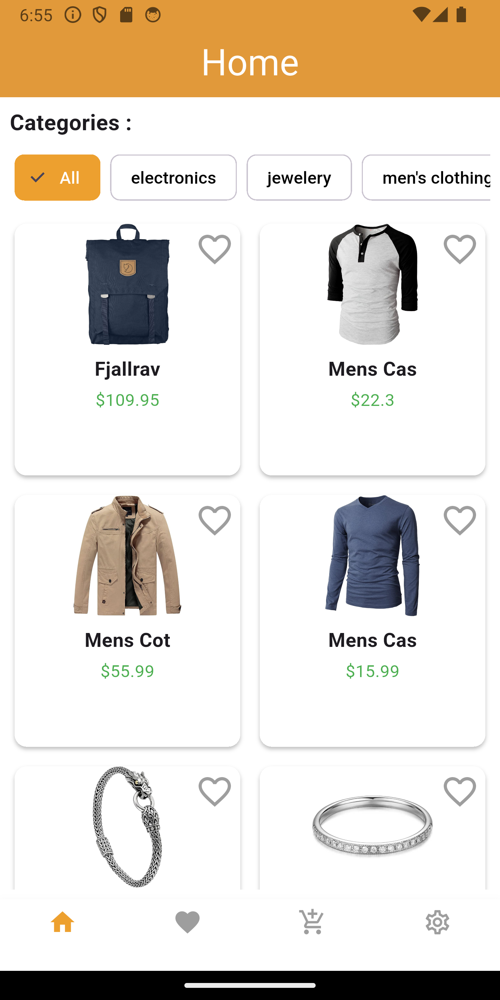
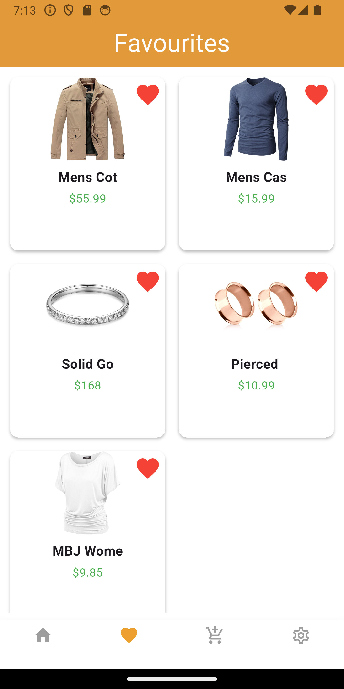
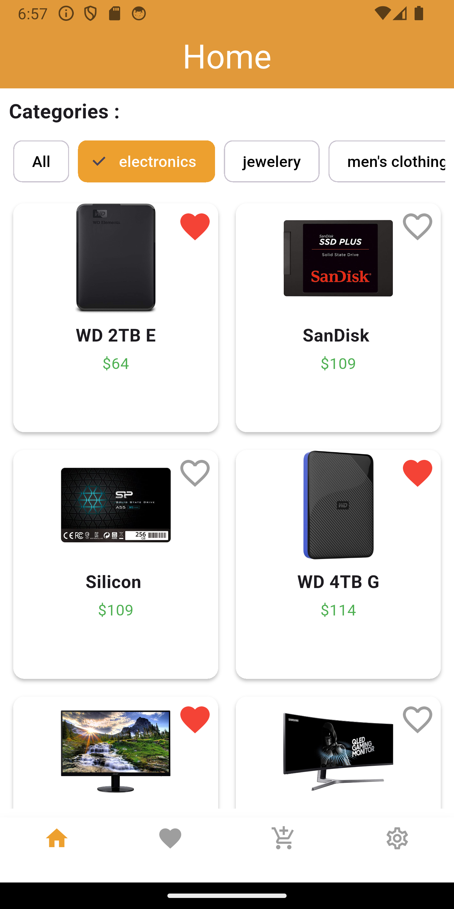

# 🛍️ Store App

Store App built with Flutter, Cubit for state management, and fetches categories and products using an API, ensuring a seamless browsing experience.

## ✨ Features
- 🚀 **Fast & Responsive UI** – Uses Bloc for smooth state management.
- 📦 **API Integration** – Fetches products dynamically.

## 🛠️ Tech Stack
- **Flutter & Dart**
- **Cubit (flutter_bloc)** for state management
- **REST API** for fetching products & categories

## 📸 Screenshots




---

## 🚀 Getting Started
1. Clone the repository:
   ```sh
   git clone https://github.com/MohamedBa3ly/Store_App_Flutter.git

